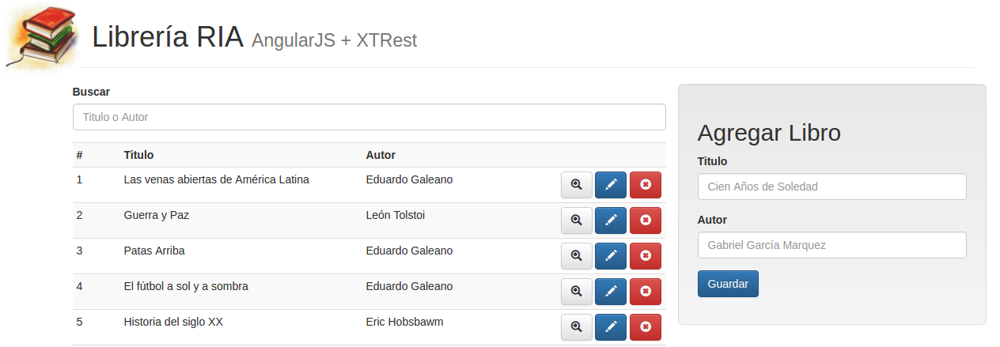

# eg-libros-angular-xtrest

Ejemplo de API Rest con aplicación web en angularjs mezclando herramientas:

- del lado cliente: es una aplicación Angular 1.x con ES6
- del lado servidor: la API REST implementado en Xtrest

## Modos de uso

### Levantar el servidor

Hay que ejecutar `LibrosController`, que levanta el servidor en el puerto 9200. A continuación contamos dos opciones de hacerlo.

#### Desde Eclipse

1. Importar en Eclipse como Maven project.
2. Ejecutar `org.uqbar.ui.angular.libros.xtrest.LibrosController`.

#### Desde la terminal (para ahorrar recursos)

Esta opción requiere menos recursos de sistema porque evita Eclipse.

1. Generar jar: `mvn clean compile assembly:single`
2. Ejecutar el jar generado: `java -jar target/*.jar`

### Probarlo

Se puede probar de dos formas: ya sea la aplicación web (que usa la API Rest), o directamente la API Rest. En ambos casos, lo primero a hacer es levantar el servidor HTTP (como se explica más arriba).

#### Probar API Rest

   * En el navegador: <http://localhost:9200/libros>.
   * En [Postman](https://www.getpostman.com/): importar [este archivo](Libros.postman_collection.json), que provee varios ejemplos de request listos para usar.
   
#### Probar Aplicación Web

1. Ir al directorio donde está definida la aplicación web: `cd src/main/webapp`.
2. Descargar dependencias: `npm install`.
3. En el navegador: <http://localhost:9200/>.

